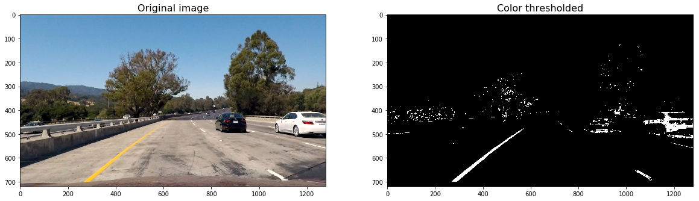

# Self-Driving Car Engineer Nanodegree

## **Advanced Lane Finding on the Road** 

## Overview

In this project, I will write a software pipeline to identify the lane boundaries in a video from a front-facing camera on a car. The camera calibration images, test road images, and project videos are available .

## Steps
My pipeline consisted of 10 steps:

1. Import and initialize the packages needed in the project,
2. Compute the camera calibration matrix and distortion coefficients given a set of chessboard images,
2. Apply a distortion correction to raw images,
4. Use color transforms, gradients, etc., to create a thresholded binary image,
5. Apply a perspective transform to rectify binary image ("birds-eye view"),
6. Detect lane pixels and fit to find the lane boundary,
7. Determine the curvature of the lane, and vehicle position with respect to center,
8. Warp the detected lane boundaries back onto the original image,
9. Display lane boundaries and numerical estimation of lane curvature and vehicle position,
10. Run pipeline in a video.

### Step 1: Import and initialize the packages needed in the project

It is not good to reinvent the wheel every time. That's why I have chosen to use some well known libraries:

- [OpenCV](https://opencv.org/) - an open source computer vision library,
- [Matplotbib](https://matplotlib.org/) - a python 2D plotting libray,
- [Numpy](http://www.numpy.org/) - a package for scientific computing with Python,
- [MoviePy](http://zulko.github.io/moviepy/]) - a Python module for video editing.

### Step 2: Compute the camera calibration using chessboard images

The next step is to perform a camera calibration. A set of chessboard images will be used for this purpose.

I have defined the `calibrate_camera` function which takes as input parameters an array of paths to chessboards images, and the number of inside corners in the _x_ and _y_ axis.

For each image path, `calibrate_camera`:
- reads the image by using the OpenCV [cv2.imread](https://docs.opencv.org/3.0-beta/doc/py_tutorials/py_gui/py_image_display/py_image_display.html) function, 
- converts it to grayscale usign [cv2.cvtColor](https://docs.opencv.org/3.0.0/df/d9d/tutorial_py_colorspaces.html), 
- find the chessboard corners usign [cv2.findChessboardCorners](https://docs.opencv.org/2.4/modules/calib3d/doc/camera_calibration_and_3d_reconstruction.html?highlight=calib)

Finally, the function uses all the chessboard corners to calibrate the camera by invoking [cv2.calibrateCamera](https://docs.opencv.org/3.0-beta/doc/py_tutorials/py_calib3d/py_calibration/py_calibration.html).

Below, it can be observed the result of undistorting one of the chessboard images:

### Step 2: Apply a distortion correction to raw images

Another OpenCv funtion, [cv2.undistort](https://docs.opencv.org/3.0-beta/doc/py_tutorials/py_calib3d/py_calibration/py_calibration.html), will be used to undistort images.

The values returned by `cv2.calibrateCamera` will be used later to undistort our video images.

### Step 4: Use color transforms, gradients,....

In this step, we will define the following funtions to calculate several gradient measurements (x, y, magnitude, direction and color).

- Calculate directional gradient: `abs_sobel_thresh()`.
- Calculate gradient magnitude: `magude_thres()`.
- Calculate gradient direction: `dir_thresh()`.
- Calculate color threshold: `col_thresh()`.

Then, `combine_threshs()` will be used to combine these thresholds, and produce the image which will be used to identify lane lines in later steps.

Below, I have copied the result of applying each function to a sample image:

- Calculate directional gradient for _x_ and _y_ orients:

- Calculate gradient magnitude 

- Calculate gradient direction 

- Calculate color threshold

The output image resulting of combining each thresh can be observed below:

### Step 5: Apply a perspective transform .

The next step in our pipeline is to transform our sample image to _birds-eye_ view.

The process to do that is quite simple:

- First, you need to select the coordinates corresponding to a [trapezoid](https://en.wikipedia.org/wiki/Trapezoid) in the image, but which would look like a rectangle from _birds_eye_ view.
- Then, you have to define the destination coordinates, or how that trapezoid would look from _birds_eye_ view. 
- Finally, Opencv function [cv2.getPerspectiveTransform](https://docs.opencv.org/2.4/modules/imgproc/doc/geometric_transformations.html#getperspectivetransform) will be used to calculate both, the perpective transform _M_ and the inverse perpective transform _Minv.
- _M_ and _Minv_ will be used respectively to warp and unwarp the video images.

Please find below the result of warping an image after transforming its perpective to birds-eye view:

> Please notice that the function`warped` does not return the unwarped version of the image. That would be performed in a later step.

### Step 6: Detect lane pixels and fit to find the lane boundary.

 In order to detect the lane pixels from the warped image, the following steps are performed.
 
 - First, a histogram of the lower half of the warped image is created. Below it can be seen the histogram and the code used to produce it.

- Then, the starting left and right lanes positions are selected by looking to the max value of the histogram to the left and the right of the histogram's mid position.
- A technique known as _Sliding Window_ is used to identify the most likely coordinates of the lane lines in a window, which slides vertically through the image for both the left and right line.
- Finally, usign the coordinates previously calculated, a second order polynomial is calculated for both the left and right lane line. Numpy's function [np.polyfit](https://docs.scipy.org/doc/numpy/reference/generated/numpy.polyfit.html) will be used to calculate the polynomials.

Please find below the result of applying the `detect_lines()` function to the warped image:

Once you have selected the lines, it is reasonable to assume that the lines will remain there in future video frames.
`detect_similar_lines()` uses the previosly calculated _line_fits_ to try to identify the lane lines in a consecutive image. If it fails to calculate it, it invokes `detect_lines()` function to perform a full search.

### Step 7: Determine the curvature of the lane, and vehicle position with respect to center.

At this moment, some metrics will be calculated: the radius of curvature and the car offset.

The code is quite self-explicative, so I'll    leave to the reader its lecture. For further information, please refer to  `Lesson 15: Advanced Techniques for Lane Finding`

### Step 8: Warp the detected lane boundaries back onto the original image.

Let's recap. We have already identified the lane lines, its radius of curvature and the car offset.

The next step will be to draw the lanes on the original image:

- First, we will draw the lane lines onto the warped blank version of the image.
- The lane will be drawn onto the warped blank image using the Opencv function [cv2.fillPoly](https://docs.opencv.org/2.4/modules/core/doc/drawing_functions.html#fillpoly). 
- Finally, the blank will be warped back to original image space using inverse perspective matrix (Minv).

This code is implemented in the `draw_lane()` function
An example of its output can be observed below:

### Step 9: Display lane boundaries and numerical estimation of lane curvature and vehicle position.

The next step is to add metrics to the image. I have created a method named `add_metrics()` which receives an image and the line points and returns an image which contains the left and right lane lines radius of curvature and the car offset. 

This function makes use of the previously defined `curvature_radius()` and `car_offset()` function.

Please find below the output image after invoking `add_metrics`:

### Step 9: Run pipeline in a video.

In this step, we will use all the previous steps to create a pipeline that can be used on a video.

The first thing I have done is to create the `ProcessImage` class. I have decided to use a class instead of a method because it would let me calibrate the camera when initializing the class and also keep some track of the previously detected lines.

Please notice that this is a very basic implementation. I have not implemented sanity checks nor lines smoothing yet. I will implement that in the future. I think the final results are good enough and I am running out of time for this term (I have till 28th of May to complete it). 
I have used MoviePy's [VideoFileClip]
## Discussion

This has been a really challenging project and I am quite happy with the results.

 Nevertheless, there is still some room for improvements in the `ProcessImage` class:

- Keep track of the last several detections of the lane lines were and what the curvature was, so it can properly be treated new detections:
- Perform some sanity checks to confirm that the detected lane lines are real:
  - Checking that they have similar curvature,
  - Checking that they are separated by approximately the right distance horizontally,
  - Checking that they are roughly parallel.
- Smoothing:
  - Even when everything is working, line detections will jump around from frame to frame a bit and it can be preferable to smooth over the last n frames of video to obtain a cleaner result. Each time a new high-confidence measurement is calculated, it can be appended  to the list of recent measurements and then take an average over n past measurements to obtain the lane position to draw onto the image. 

I will implement these changes in the future, but I am running out of time to complete term 1, so I have decided to leave them for the next weeks.

Finally, the pipeline might fall if a white car is too close to the left or right lanes, and also when a white car is in front of our car and quite close to us.

I really hope you have enjoyed this lecture as much as I have done writting it for you.

